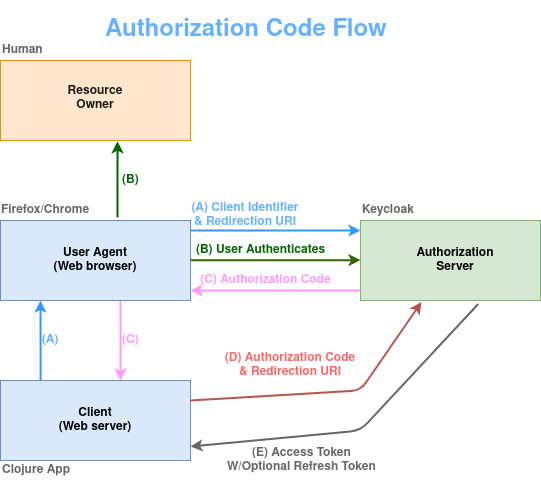

# OAuth 2.0 with Keycloak and Clojure



## Authorization Client (Clojure)
The Clojure projects are managed with the Clojure CLI tool. The `deps.edn` file holds the configuration and the needed dependencies.
Cd into the `clj-auth-service` directory and execute this command:
```
$ clj -M -m core.sso-clojure
```
Our authorization service will be running at port `3000`.

## License

* [Apache License, Version 2.0](https://www.apache.org/licenses/LICENSE-2.0)
